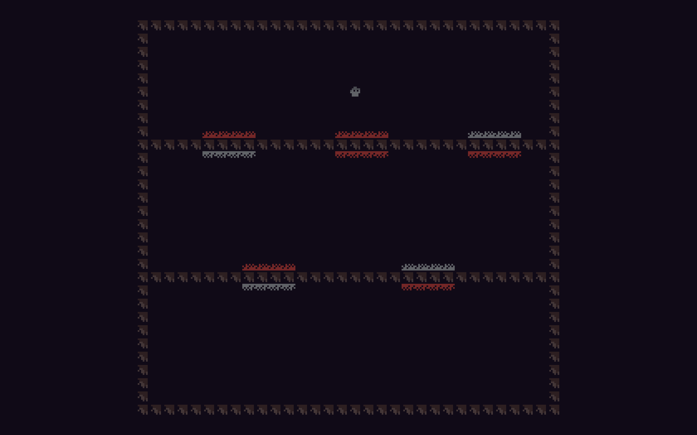

Join My Colored Friends

Author: Cheyu Tu

Design:
A grey little creature wants to turn red and join the red creature friend group. It discovers that the mysterious doors can change its color...

Screen Shot:

How Your Asset Pipeline Works:

Credit: Used ChatGPT for assistance
1. Author PNGs (GIMP):
Draw pixel art on an 8×8 grid. Each sheet uses ≤4 colors (index 0 = transparent). Current palettes:
• Background: #301e21, #463537, #110a18
• Characters & doors use their own 4-color palettes. Save as PNG. 

2. Load & pack at runtime:
PNGs are loaded with load_png(...) and converted to PPU tiles using Sprites::pack_png_tileset(...) for sheets and Sprites::pack_png_single_tile(...) for individual 8×8 tiles. The packer maps RGBA → 2-bit palette indices. 

3. Upload tiles & palettes to the PPU:
Packed tiles are copied into fixed slots in ppu.tile_table (e.g., background at base 1, characters at 10 and 20, doors at 30), and their 4-color palettes are written to ppu.palette_table (BG in slot 0; characters in 7 and 5; doors in 6). Tile 0 is a blank/transparent tile. 

4. Build the background map:
Clear ppu.background to tile 0 so the solid background_color shows, then place wall tiles along the screen borders and on specific rows (counted from the top) by writing indices into the background tilemap. 

5. Place sprites for player and props (doors):
The player uses a character tile and is drawn from a live player_at position each frame. Doors are loaded as single 8×8 tiles, assigned a shared palette, and placed as sprites at specified (row, col) locations (1-based, from top-left). Door overlap triggers row±3 movement; solid-tile collision comes from the background map (non-zero tiles are solid). 

WIP:
- If the player is grey and touches the grey side of door, they will be moved to the other side (by modifying row by ±3) and changed sprite to use char_red_tiles.png
- If the player is red and touches the red side of door, they will be moved to the other side (by modifying row by ±3) and changed sprite to use char_grey_tiles.png
- If the player color is different from a side of the door, nothing will happen when they collide.
- A target (some red characters (dist/assets/char_red_tiles.png) should be put at the bottom of the map). When player is red and reaches them, game success.

Source files: they are in dist/assets

How To Play:

Control: use the arrow keys to control the little creature. T
Goal: let the little creature reach the red creatures, and make sure that it becomes red when it reache them.

This game was built with [NEST](NEST.md).

